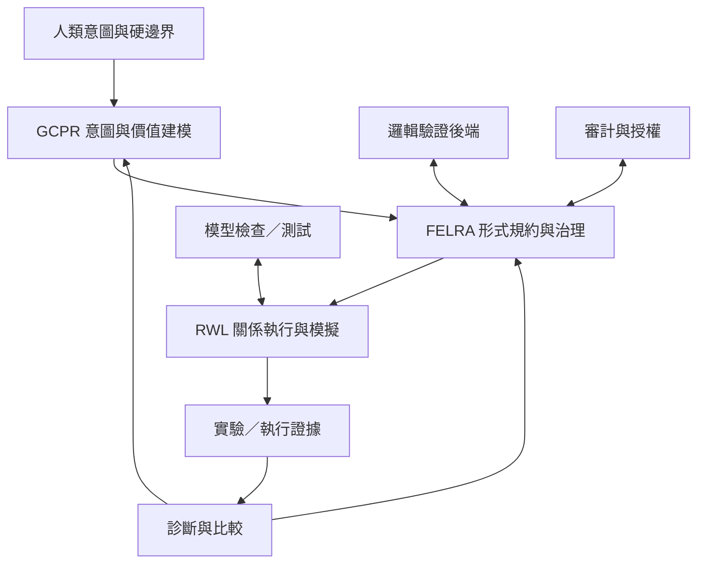

# GCPR–RWL–FELRA 技術白皮書

## Python 優先的 AI 自主形式化、學術驗證與可視化研究架構

**英文名稱：** GCPR–RWL–FELRA: Python-First Academic Verification, Visualization, and Formal Evolving Logic-Rule Architecture  
**作者：** Neo.K  
**機構：** 一言諾科技有限公司（EveMissLab）  
**版本：** v1.0 — Python 優先學術驗證與可視化實作版  
**日期：** 2026 年 7 月 14 日  
**文件性質：** 技術白皮書／內部核心架構草案  
**前身：** GCPR–RWL–Axiom 1.0、2.0、3.0

---

## 摘要

本白皮書提出 **GCPR–RWL–FELRA** 整合架構，作為原 GCPR–RWL–Axiom 系列的正式命名重構與技術統合版本。

原名稱中的 **Axiom** 最初指涉一套以 `requires`、`ensures`、`proves` 與證明義務為核心的形式驗證語言。然而，隨著架構由 1.0 的意圖推斷與三類錯誤診斷，演化至 2.0 的八算子、規則重寫與元學習，再推進至 3.0 的維度幾何、率失真優化與雙層記憶，該系統早已超出「公理語言」的語義範圍。

因此，本白皮書將其正式更名為：

> **FELRA — Formal Evolving Logic-Rule Architecture**  
> **形式演化邏輯—規則架構**

FELRA 不是單一公理集，也不只是形式驗證語言。它是一個將人類模糊意圖轉化為可審計形式規約，並允許 AI 在硬邊界內進行約束診斷、規則修正、邏輯升降維、證明義務生成與執行反饋學習的完整架構。

在新的術語體系中，**axiom** 不再指整個系統，而只保留為 FELRA 內部「不可任意鬆弛的基礎公理或硬前提」之一類。FELRA 的形式條款至少包括：硬公理、可調約束、契約、不變量、目標、證明義務與元規則。這項重構解決了舊架構中「可演化規則卻被稱為公理」的類別錯誤。

本白皮書定義 GCPR、FELRA 與 RWL 的責任邊界，建立統一形式模型、八算子運行核心、意圖—規約維度匹配機制、雙層記憶、診斷閉環、FELRA-Spec 語言草案、編譯與驗證工具鏈、治理模型、遷移規則及實作路線圖。

v1.0 進一步確立 **Python 優先、學術優先、證據先行** 的首階段實作策略。FELRA 的第一個可用版本，不以一次實現完整定理證明、RWL 編譯與自我演化為目標，而是先建立供研究者日常使用的 Python 學術驗證與可視化工作台。系統應能把理論命題轉換為可重現的計算實驗，執行符號、數值、統計、邊界、敏感度、反例與有限域全域搜索，並自動產生與證據綁定的圖表、資料表、驗證報告與後續 FELRA 規約候選。

因此，新的工程順序是：先用 Python 暴露錯誤、建立證據、形成穩定不變量，再將成熟命題提升為 FELRA 條款、SMT／定理證明義務與 RWL 執行模型。Python 在此不是最終真理機器，而是**機器初步驗證、理論探索、資料分析、反例發現與學術溝通的主工作層**。

需要特別說明：舊版文件中的部分性能百分比、收斂定理與「元圖靈完備」敘述，目前應視為**內部假說、模擬結果或待驗證主張**，而非已完成獨立重現的工程事實。本白皮書將其降級為研究目標與驗證計畫，以維持理論強度與技術可信度之間的平衡。

**關鍵詞：** FELRA、GCPR、RWL、Python、學術驗證、全域驗證、科學可視化、可重現研究、AI 自主形式化、形式驗證、規則演化、意圖推斷、證明義務、八算子、維度幾何、率失真、雙層記憶、人機協作

---

# 1. 問題定義

## 1.1 形式驗證的前置悖論

傳統形式驗證流程通常假設：

1. 人類已經知道自己真正想要什麼；
2. 人類能將意圖完整轉化為形式規約；
3. 規約正確時，驗證器只需要判斷程式是否符合規約。

理想流程可寫為：

$$
h \xrightarrow{\text{人類形式化}} A \xrightarrow{\text{程式生成}} C \xrightarrow{\text{驗證}} \{\text{pass},\text{fail}\}
$$

其中：

- $h$：人類意圖或心像；
- $A$：形式規約；
- $C$：可執行實現。

然而，當 $h \to A$ 本身存在投影損失、歧義、過度約束或邏輯衝突時，驗證失敗不再只代表程式錯誤。它也可能代表規約錯誤，甚至代表原始意圖彼此不相容。

因此，真正的問題不是：

> AI 生成的程式是否符合人類寫下的規約？

而是：

> 當人類不能保證規約完整且正確時，系統如何同時診斷實現、規約與意圖，並維持不可越過的價值與安全邊界？

## 1.2 三種基本缺陷

### 1.2.1 表徵缺失

人類心像可能具有高維、模糊、情境依賴與非語言成分。自然語言表達是一次壓縮：

$$
\Pi_{h\to n}: \mathcal H \to \mathcal N
$$

若 $\mathcal H$ 的有效維度高於自然語言表達所保留的維度，通常存在：

$$
I(h;\Pi_{h\to n}(h)) < H(h)
$$

亦即，表達後保留的互信息小於原始心像資訊量。

### 1.2.2 形式化非唯一

同一意圖可能對應多個形式規約：

$$
\mathfrak F(h)=\{F_1,F_2,\ldots,F_m\}
$$

這些規約可能擁有不同的：

- 表達能力；
- 可判定性；
- 驗證成本；
- 意圖失真；
- 可行域大小；
- 安全風險。

形式化不是單一翻譯，而是多目標選擇問題。

### 1.2.3 驗證失敗的語義歧義

當驗證器回傳失敗時，至少存在三種語義來源：

- **Type I：實現錯誤**——RWL 或下游程式未滿足正確規約；
- **Type II：規約錯誤**——規約過嚴、遺漏、錯置或採用不適當邏輯；
- **Type III：意圖衝突**——原始目標、價值權重或硬邊界互相矛盾。

此外，工程實作中還必須區分一個非語義通道：

- **Infrastructure Fault：驗證器、求解器、資源限制或資料管線故障。**

它不應被錯判為 Type I–III，否則系統會對正確規約或實現進行錯誤修正。

---

# 2. 命名重構：從 Axiom 到 FELRA

## 2.1 原名稱的類別錯誤

公理通常被理解為某一形式系統內不經該系統內部證明而接受的基礎前提。若一條規則可以被系統依反饋自動鬆弛、重寫、升維、替換或刪除，它便不應在所有語境下都被稱為公理。

舊架構將以下不同對象統稱為 Axiom：

- 不可修改的物理或倫理硬邊界；
- 可調整閾值；
- 前置與後置條件；
- 執行不變量；
- 優化目標；
- 驗證性質；
- 生成規則；
- 元學習後被改寫的邏輯模板。

這會導致兩個問題：

1. **語義過載**：無法辨別哪些條款可改、哪些不可改；
2. **治理模糊**：系統「修改公理」究竟是正常適應，還是越過人類授權邊界？

## 2.2 FELRA 的正式定義

**定義 2.1（FELRA）**

FELRA 是一個面向 AI 自主形式化的形式演化邏輯—規則架構：

$$
\mathrm{FELRA}
=
(\mathcal M_F,\mathcal L_F,\Gamma_F,\Omega_F,\mathcal O_F,\mathcal Z_F)
$$

其中：

- $\mathcal M_F$：形式狀態與規約母空間；
- $\mathcal L_F$：可使用的邏輯與規約語言族；
- $\Gamma_F$：當前形式條款集合；
- $\Omega_F$：不可越過的硬邊界與治理策略；
- $\mathcal O_F$：生成、比較、驗證、診斷與演化算子；
- $\mathcal Z_F$：證據鏈、決策紀錄與版本軌跡。

FELRA 的核心不是保證所有條款永遠不變，而是保證：

> **只有被授權為可演化的條款可以演化；所有演化都必須留下可重放、可比較、可撤回的證據。**

## 2.3 FELRA 的條款分類

令形式條款總集為：

$$
\Gamma_F
=
(\mathcal A_h,\mathcal C_a,\mathcal T,\mathcal I,\mathcal G,\mathcal P,\mathcal R_m)
$$

| 類型 | 符號 | 功能 | 預設可否自動修改 |
|---|---:|---|---|
| 硬公理 | $\mathcal A_h$ | 物理、法律、倫理或安全的不可越界前提 | 否 |
| 可調約束 | $\mathcal C_a$ | 閾值、資源、偏好與可協商限制 | 有條件 |
| 契約 | $\mathcal T$ | 前置條件、後置條件、例外行為 | 有條件 |
| 不變量 | $\mathcal I$ | 執行或演化過程中必須保持的性質 | 通常否 |
| 目標 | $\mathcal G$ | 最小化、最大化或滿足的方向 | 可調權重 |
| 證明義務 | $\mathcal P$ | 交由 SMT、定理證明器或模型檢查器處理的命題 | 可重新生成 |
| 元規則 | $\mathcal R_m$ | 決定條款如何生成、比較、演化與回滾 | 高度受控 |

因此：

$$
\mathcal A_h \subsetneq \Gamma_F
$$

Axiom 被保留為 FELRA 的子類，而非整個架構的名稱。

## 2.4 新舊術語對照

| 舊稱 | 新稱 | 說明 |
|---|---|---|
| Axiom System | FELRA System | 指完整架構 |
| Axiom Language | FELRA-Spec | 指規約語言 |
| Axiom Compiler | FELRA Compiler | 指編譯與證明義務生成器 |
| Axiom Verifier | FELRA Verification Orchestrator | 指多後端驗證協調器 |
| Axiom Space | FELRA Formal Space | 指形式規約與邏輯狀態空間 |
| Axiom Generation | Formal Clause Synthesis | 生成多類形式條款 |
| Axiom Evolution | FELRA Rule Evolution | 規約與元規則的受控演化 |
| Axioms | Formal Clause Set | 除非明確只指硬公理 |

---

# 3. GCPR–FELRA–RWL 的責任分層

## 3.1 三個系統不是同一層的替代品

GCPR、FELRA 與 RWL 分別回答不同問題：

- **GCPR：為何創造、創造什麼、如何評估價值？**
- **FELRA：如何將意圖轉化為可驗證、可治理、可演化的形式規約？**
- **RWL：如何以關係優先的方式執行、模擬與更新系統狀態？**

新的標準流程為：

$$
\text{Human Intent}
\xrightarrow{\mathrm{GCPR}}
\text{Intent Model}
\xrightarrow{\Pi_{\mathrm{formal}}}
\text{FELRA Specification}
\xrightarrow{\Pi_{\mathrm{execute}}}
\text{RWL Program}
\xrightarrow{\mathrm{Run}}
\text{Evidence}
\xrightarrow{\mathrm{Feedback}}
\text{GCPR/FELRA Update}
$$

## 3.2 四層架構

### Layer 0：價值與授權層

人類或治理主體定義：

$$
(h,w,\Omega_{\mathrm{hard}},B_{\mathrm{authority}})
$$

其中：

- $h$：心像、自然語言、示例或多模態意圖；
- $w$：價值與目標權重；
- $\Omega_{\mathrm{hard}}$：絕對不可違反的硬邊界；
- $B_{\mathrm{authority}}$：AI 可以自主修改哪些形式條款的授權集合。

### Layer 1：GCPR 意圖與價值建模層

GCPR 將模糊意圖轉化為候選意圖模型：

$$
\mathcal I^* = \arg\max_{\mathcal I} P(\mathcal I\mid h,w,E_{0:t})
$$

並定義創造目標泛函：

$$
J(C;h,\Theta)
=
\alpha D(C,\mathcal I^*)
+
\beta \mathcal R_C(C)
+
\gamma \mathrm{Risk}(C)
$$

### Layer 2：FELRA 形式化與治理層

FELRA 將 $\mathcal I^*$ 投影為條款集合 $\Gamma_F$，生成證明義務、選擇邏輯後端、比較候選規約，並在授權域內進行修正。

### Layer 3：RWL 執行與實驗層

RWL 接收 FELRA-Spec 所約束的執行語義，進行關係網路演化、狀態重寫、多尺度耦合、模擬或下游代碼生成。

## 3.3 驗證是跨層能力

驗證不應被封閉在單一層。至少包含：

- GCPR：意圖與價值對齊驗證；
- FELRA：邏輯一致性、完備度代理指標與證明義務驗證；
- RWL：執行軌跡、狀態轉移與不變量驗證；
- 現實層：實驗、觀測、資料與外部系統回饋。

所以，更準確的結構是交叉驗證網，而不是單向包含鏈。



---

# 4. 八算子運行核心

FELRA 延續 2.0 所引入的八算子框架，但不再宣稱其已被嚴格證明為「唯一必要且充分」的終極集合。較穩健的定位是：

> 八算子構成目前版本的最小工作架構候選；其最小性、獨立性與完備性仍需形式化證明與消融實驗。

令：

$$
\mathbb O_8=\{\mathfrak M,E,C,V,\mathrm{Co},\Pi,\mathcal R,\mathcal K\}
$$

## 4.1 母集算子 $\mathfrak M$

定義不同層的狀態空間、邊界、邏輯語境與資源限制：

$$
\mathfrak M_i=(S_i,L_i,B_i,Q_i)
$$

其中 $S_i$ 為狀態集、$L_i$ 為可用語言或邏輯、$B_i$ 為邊界、$Q_i$ 為資源與品質條件。

## 4.2 生成算子 $E$

由意圖模型生成形式條款候選：

$$
E:(\mathcal I,\mathfrak M_F,\Theta_E)\to\{\Gamma_F^{(1)},\ldots,\Gamma_F^{(n)}\}
$$

## 4.3 檢查算子 $C$

對候選規約進行語法、類型、邏輯一致性、可判定性與後端相容性檢查：

$$
C(\Gamma_F)=(c_{\mathrm{syntax}},c_{\mathrm{type}},c_{\mathrm{logic}},c_{\mathrm{backend}})
$$

## 4.4 選擇算子 $V$

在多個可行候選中選出符合治理與多目標品質要求者：

$$
V(\{\Gamma_i\})
=
\arg\min_{\Gamma_i}
\left[
\lambda_R R(\Gamma_i)+
\lambda_D D(h,\Gamma_i)+
\lambda_C C_v(\Gamma_i)+
\lambda_Q Q_r(\Gamma_i)
\right]
$$

其中 $Q_r$ 為風險成本。

## 4.5 同步算子 $\mathrm{Co}$

避免意圖、規約、執行環境與資料版本不同步：

$$
\mathrm{Co}(h_t,\Gamma_t,R_t,E_t)\to \mathrm{Snapshot}_t
$$

所有驗證結果必須綁定同一快照識別碼，否則不得用於規則演化。

## 4.6 投影算子 $\Pi$

至少包含兩次投影：

$$
\Pi_{\mathrm{formal}}:\mathcal I\to\Gamma_F
$$

$$
\Pi_{\mathrm{execute}}:\Gamma_F\to\mathrm{RWL}
$$

投影不是無損同構；系統必須測量失真與不可表達殘差。

## 4.7 規則算子 $\mathcal R$

在授權域內修改生成、檢查、選擇與投影規則：

$$
\mathcal R:
(\Theta_E,\Theta_C,\Theta_V,\Theta_\Pi,\Delta)
\to
(\Theta'_E,\Theta'_C,\Theta'_V,\Theta'_\Pi)
$$

但必須滿足治理不變量：

$$
\forall r\in\mathcal R,
\quad
r(\Omega_{\mathrm{hard}})=\Omega_{\mathrm{hard}}
$$

除非取得更高授權層的明確變更簽章。

## 4.8 比較算子 $\mathcal K$

比較兩個形式規約或兩次演化狀態：

$$
\mathcal K(\Gamma_i,\Gamma_j\mid h,\Omega)
\to
\mathbb R^m
$$

可包含：

- 意圖覆蓋度；
- 邏輯一致度；
- 可驗證性；
- 驗證成本；
- 執行可行性；
- 風險與越權程度；
- 版本差異與可回滾性。

元反思循環為：

$$
\Phi^{(n)}
\xrightarrow{\mathcal K}
\Delta^{(n)}
\xrightarrow{\mathcal R}
\Phi^{(n+1)}
$$

其中 $\Phi$ 是當前形式化策略，而不是單一公理集合。

---

# 5. 維度幾何化與率失真模型

## 5.1 意圖的結構表示

意圖可先以概念、關係與層級構成張量近似：

$$
h\in\mathbb R^{C\times R\times L}
$$

其中：

- $C$：概念維；
- $R$：關係維；
- $L$：抽象與條件層級。

此表示不是唯一真實本體，而是一種可操作的結構化近似。

## 5.2 從意圖維度到 FELRA 維度

舊版的 $d_{\mathrm{axiom}}$ 應統一改為：

$$
d_{\mathrm{FELRA}}
$$

形式化投影為：

$$
\Pi_{\mathrm{formal}}:
\mathbb R^{d_{\mathrm{intent}}}
\to
\mathbb R^{d_{\mathrm{FELRA}}}
$$

維度失配量定義為：

$$
\Delta_d=
\left|d_{\mathrm{intent}}-d_{\mathrm{FELRA}}\right|
$$

需要注意：維度較高不必然較好。過低可能造成語義遺失，過高則可能造成過擬合、不可判定、驗證成本爆炸或規約僵化。

## 5.3 率—失真—成本—風險目標

3.0 的三目標模型可進一步擴展為四目標：

$$
\min_{\Gamma_F}
\left[
R(\Gamma_F)
+
\lambda D(h,\Pi^{-1}(\Gamma_F))
+
\mu C_v(\Gamma_F)
+
\nu Q_r(\Gamma_F)
\right]
$$

其中：

- $R(\Gamma_F)$：規約率或描述複雜度；
- $D$：意圖重建失真；
- $C_v$：驗證與執行成本；
- $Q_r$：治理、安全與現實風險。

最優候選應位於多目標帕累托前沿：

$$
\Gamma_F^*\in\operatorname{Pareto}(R,D,C_v,Q_r)
$$

這並不保證存在唯一全局最優解。最終選擇仍依賴權重、授權層與應用領域。

## 5.4 規則演化的幾何解釋

$\mathcal R$ 可被理解為調整形式化模型的表達容量與幾何結構：

$$
\mathcal R:
(d_{\mathrm{FELRA}},\mathcal L_F,\Theta)
\to
(d'_{\mathrm{FELRA}},\mathcal L'_F,\Theta')
$$

可能操作包括：

- 增加或刪除謂詞；
- 由單一閾值改為分段條件；
- 由一階邏輯切換至時序、模態、概率或混合邏輯；
- 將全稱硬約束降為帶置信度的軟約束；
- 將不可判定規約近似投影至可驗證子語言；
- 將高成本規約分解為局部可證明模組。

---

# 6. 診斷—修正閉環

## 6.1 標準閉環

$$
\mathrm{Generate}
\to
\mathrm{Verify}
\to
\mathrm{Diagnose}
\to
\mathrm{Repair}
\to
\mathrm{Reverify}
$$

診斷結果為：

$$
\delta_t
=
(\tau_t,p_t,e_t,a_t)
$$

其中：

- $\tau_t$：錯誤類型；
- $p_t$：診斷置信度；
- $e_t$：支持證據；
- $a_t$：允許採取的修正集合。

## 6.2 Type I：實現錯誤

條件：規約內部一致，且存在反例表明 RWL 行為違反條款。

修正目標：

$$
RWL_{t+1}=\operatorname{repair}(RWL_t,\mathrm{counterexample})
$$

不得因 Type I 直接放寬硬邊界。

## 6.3 Type II：規約錯誤

可能細分為：

- II-a：過度約束；
- II-b：約束遺漏；
- II-c：邏輯形式不適配；
- II-d：條款層級錯置；
- II-e：驗證成本不可接受。

只有位於 $B_{\mathrm{authority}}$ 內的條款可以自動修改：

$$
\Delta\Gamma_F\subseteq B_{\mathrm{authority}}
$$

## 6.4 Type III：意圖或價值衝突

當以下可滿足性條件失敗：

$$
\operatorname{SAT}(\mathcal G\land\Omega_{\mathrm{hard}})=\mathrm{False}
$$

系統不得擅自選擇犧牲哪一個硬目標，而應輸出最小衝突核：

$$
\operatorname{MUS}(\Gamma_F)
$$

並要求授權層重新排序價值、修改目標或撤除衝突條款。

## 6.5 基礎設施故障通道

若求解器超時、記憶體不足、後端版本不一致或資料不可用，應輸出：

$$
\tau_t=\mathrm{INFRA}
$$

而不是將其分類為形式或語義錯誤。

## 6.6 修正決策紀錄

系統不需要暴露不可控的內部思維鏈，而應提供結構化、可驗證的決策紀錄：

```yaml
change_id: FELRA-CHG-000184
snapshot: sha256:...
error_class: TYPE_II_A
changed_clause: constraint.mass_limit
before: "mass < 1.0kg"
after: "mass < 1.2kg"
authority_basis: "adaptive_range[0.8, 1.5]kg"
evidence:
  - unsat_core: [mass_limit, strength_min, material_set]
  - feasible_counterexample: candidate_27
verification_backends:
  - z3: pass
  - rwl_model_checker: pass
rollback_available: true
```

---

# 7. 雙層記憶與元學習

## 7.1 記憶結構

FELRA 採用：

$$
\mathcal M_{\mathrm{memory}}
=
(\mathcal M_{\mathrm{dirty}},
\mathcal M_{\mathrm{clean}},
\Pi_{\mathrm{publish}})
$$

### 髒層 $\mathcal M_{\mathrm{dirty}}$

保存內部完整演化資料：

- 所有意圖解釋候選；
- 澄清對話與歧義消解；
- 所有 FELRA-Spec 候選；
- 被拒絕候選與拒絕原因；
- 驗證反例與不可滿足核心；
- 規則修改、回滾與失敗修復；
- 維度估計與帕累托前沿；
- 後端版本、資源與環境快照。

### 乾淨層 $\mathcal M_{\mathrm{clean}}$

保存對外可用結果：

- 最終意圖模型；
- 當前生效規約；
- 最終 RWL 或下游程式；
- 關鍵決策紀錄；
- 驗證狀態與限制；
- 可回滾版本指標。

## 7.2 為何不能只保存成功結果

若只保存成功樣本 $S$，則失敗條件 $F$ 的剩餘熵通常為：

$$
H(F\mid S)>0
$$

因此，僅由成功結果無法完整推導：

- 哪些規約形式反覆失敗；
- 失敗來自實現還是規約；
- 哪些規則修改會造成越權；
- 哪些維度失配具有跨任務重複性。

雙層記憶的工程代價是更高儲存與治理成本，因此必須加入：

- 保留期限；
- 去識別化；
- 權限分級；
- 摘要壓縮；
- 可驗證刪除；
- 敏感失敗軌跡隔離。

## 7.3 元學習更新

規則更新不直接使用單一成功或失敗，而應聚合多次證據：

$$
\Theta_{t+1}
=
\Theta_t-
\eta\nabla_{\Theta}
\mathbb E_{\mathcal D_t}
\left[
L_{\mathrm{formal}}+L_{\mathrm{risk}}+L_{\mathrm{cost}}
\right]
$$

高風險元規則更新須通過影子環境、回放測試與授權審核後才能進入生產環境。

---

# 8. FELRA-Spec 語言草案

## 8.1 設計原則

FELRA-Spec 應具備：

1. 條款類型明確；
2. 硬邊界與可調條款不可混淆；
3. 每個條款具有來源、授權與版本；
4. 可映射至多種驗證後端；
5. 可生成 RWL 約束與執行骨架；
6. 支援反例、不可滿足核心與回滾；
7. 支援確定性、概率、時序與模態規約的模組化擴充。

## 8.2 範例

```felra
module LightweightStructure v0.3 {

  intent {
    description: "設計高強度、輕量且可製造的結構件";
    source: human.multimodal_input;
    confidence: 0.86;
  }

  authority {
    human_owner: "project_lead";
    ai_may_modify: [constraint, goal.weight, proof_obligation];
    ai_may_not_modify: [axiom, invariant.safety];
  }

  axiom physical_domain {
    statement: density(material) > 0;
    mutability: immutable;
  }

  constraint mass_limit {
    requires: total_mass(structure) <= 1.0 kg;
    adaptive_range: [0.8 kg, 1.5 kg];
    relaxation_cost: 0.4;
  }

  contract manufacture(part) -> result {
    requires: manufacturable(part);
    ensures: dimensional_error(result) <= 0.2 mm;
    on_failure: return_diagnostic;
  }

  invariant safety_factor {
    always: factor_of_safety(structure) >= 2.0;
    class: safety;
    mutability: immutable;
  }

  goal optimize_design {
    minimize: total_mass(structure) weight 0.45;
    maximize: tensile_strength(structure) weight 0.35;
    minimize: manufacturing_cost(structure) weight 0.20;
  }

  proof obligation structural_integrity {
    prove: forall load in certified_loads:
           deformation(structure, load) <= allowed(load);
    backend: [smt, finite_element_checker];
  }

  evolution_policy {
    rule_change_requires: [replay_pass, no_hard_boundary_change];
    rollback: mandatory;
  }
}
```

## 8.3 核心中介表示 FELRA-IR

```json
{
  "module": "LightweightStructure",
  "version": "0.3",
  "intent_ref": "intent://sha256/...",
  "clauses": [
    {
      "id": "mass_limit",
      "kind": "constraint",
      "logic": "linear_real_arithmetic",
      "expression": "total_mass <= 1.0",
      "unit": "kg",
      "mutable": true,
      "adaptive_range": [0.8, 1.5]
    }
  ],
  "hard_boundary_hash": "sha256:...",
  "verification_plan": ["z3", "rwl-model-checker"],
  "audit_policy": "full"
}
```

---

# 9. Python 優先的學術驗證、全域檢查與可視化工具鏈

## 9.1 首個實作目標：先成為研究者真正會使用的工具

FELRA 的首個工程版本應以作者自身與學術研究工作流為主要使用情境，而不是一開始就追求完整的形式語言生態、通用 RWL 編譯器或全自動規則演化系統。

其基本原則是：

> **先讓理論可計算、可反駁、可重現、可視化，再讓其中成熟的部分進入形式規約與證明系統。**

新的主要研究流程為：

$$
\text{構想或命題}
\xrightarrow{\text{結構化}}
\text{Python 實驗計畫}
\xrightarrow{\text{計算與搜索}}
\text{資料、反例與圖形證據}
\xrightarrow{\text{命題修正}}
\text{穩定性質與不變量}
\xrightarrow{\text{提升}}
\text{FELRA 條款}
\xrightarrow{\text{後續}}
\text{SMT／定理證明／RWL}
$$

這與傳統的「先寫完整規約，再實作」不同。對尚在形成中的數學、物理、認知、語義與系統理論而言，過早形式化可能只是把尚未被發現的錯誤固定成精密語法。Python 優先模式則允許研究者先進行快速計算、失敗分析與視覺探索，再判斷哪些結構值得被提升為正式條款。

## 9.2 Python 在 FELRA 中的地位

Python 不被定義為最終證明語言，也不被宣稱能取代 Lean、Coq、Isabelle、SMT、模型檢查器或真實實驗。它承擔五種首要角色：

1. **機器初步驗證層**：執行數值、符號、統計與有限域檢查；
2. **反例搜索層**：主動尋找命題失效區、邊界條件與奇異點；
3. **理論探索層**：掃描參數空間、比較模型、觀察相變與穩定區；
4. **科學可視化層**：生成能揭示結構而非只裝飾結果的圖形；
5. **形式化前處理層**：從成功與失敗的實驗中抽取候選不變量、約束與證明義務。

因此，Python 層可形式化為：

$$
\mathcal P_{\text{research}}
=
(\mathcal D,\mathcal M,\mathcal X,\mathcal V,\mathcal F,\mathcal E)
$$

其中：

- $\mathcal D$：資料與參數域；
- $\mathcal M$：可執行模型；
- $\mathcal X$：實驗與搜索策略；
- $\mathcal V$：多維驗證器集合；
- $\mathcal F$：圖形與表格生成器；
- $\mathcal E$：證據、版本與可重現性紀錄。

## 9.3 「全域驗證」的操作性定義

本白皮書中的 **Python 全域驗證** 不表示對無限狀態空間完成一般性數學證明。它表示：在明確聲明的問題域、參數域、資料集、假設集與計算預算內，對所有已登記的可機器檢查維度進行統一編排與覆蓋。

令待驗證命題或模型為 $X$，聲明域為 $\Omega$，假設集為 $A$，資源預算為 $B$，則：

$$
\mathcal V_{\text{global}}(X;\Omega,A,B)
=
\left(
V_{\text{schema}},
V_{\text{type}},
V_{\text{unit}},
V_{\text{symbolic}},
V_{\text{numeric}},
V_{\text{property}},
V_{\text{boundary}},
V_{\text{stat}},
V_{\text{sensitivity}},
V_{\text{search}},
V_{\text{replay}}
\right)
$$

每一個驗證通道不得只輸出布林值，而應輸出：

$$
E_i=(s_i,c_i,e_i,a_i,\Omega_i,b_i)
$$

其中：

- $s_i$：`PASS`、`FAIL`、`INCONCLUSIVE`、`NOT_RUN` 或 `ERROR`；
- $c_i$：覆蓋率或信心代理量；
- $e_i$：證據位置；
- $a_i$：依賴假設；
- $\Omega_i$：實際檢查範圍；
- $b_i$：未覆蓋邊界與限制。

因此，「全域」指的是**驗證編排與證據覆蓋的全域性**，不是宣稱已經證明宇宙中所有輸入均成立。

## 9.4 驗證層級

| 層級 | 名稱 | 主要問題 | Python 方法示例 |
|---|---|---|---|
| V0 | 可重現性與環境驗證 | 能否在相同環境重跑？ | 隨機種子、環境鎖定、資料雜湊、執行紀錄 |
| V1 | 結構驗證 | 輸入、輸出、型別與單位是否合理？ | Schema、型別、單位與缺失值檢查 |
| V2 | 符號驗證 | 代數恆等、導數、極限與簡化是否一致？ | 符號運算、精確算術、等價性檢查 |
| V3 | 數值健全性 | 是否出現溢位、奇異、病態或精度失真？ | 高精度計算、條件數、誤差傳播 |
| V4 | 性質與不變量驗證 | 已聲明性質是否在大量樣本與狀態轉移中保持？ | Property-based tests、狀態軌跡檢查 |
| V5 | 邊界與反例驗證 | 命題在哪些臨界點、極端值與非法域失效？ | 邊界枚舉、模糊測試、對抗搜索 |
| V6 | 統計與不確定性驗證 | 結論是否穩健、顯著且可區分於噪音？ | Bootstrap、交叉驗證、置信區間、殘差分析 |
| V7 | 敏感度與有限域全域搜索 | 結果是否只依賴狹窄參數，是否存在其他解區？ | 網格、隨機、準隨機、最佳化與 Monte Carlo 搜索 |
| V8 | 跨方法一致性 | 不同算法、解析近似或精度下是否得到相容結果？ | 多方法重算、差分比較、獨立實作 |
| V9 | 形式與外部驗證 | 哪些性質可提升為正式證明或真實實驗？ | Z3Py、定理證明接口、模型檢查、外部資料或實驗 |

V0–V8 構成 Python 優先研究層；V9 是通往 FELRA 正式後端與外部世界的橋接層。

## 9.5 建議的 Python 技術棧

Python 工作台採模組化而非單一大型框架：

| 功能 | 建議工具類型 |
|---|---|
| 陣列與數值 | NumPy、SciPy |
| 資料表與標註資料 | pandas、xarray |
| 符號與精確運算 | SymPy、`decimal`、`fractions`、高精度數值庫 |
| 統計與模型分析 | SciPy 統計模組、statsmodels 類工具 |
| 結構與輸入驗證 | dataclass、Pydantic 類 Schema、單位系統 |
| 測試與反例生成 | pytest、Hypothesis 類 property-based testing |
| 圖論與關係分析 | NetworkX 類圖結構工具 |
| 科學繪圖 | Matplotlib；互動探索可增加 Plotly 類工具 |
| Notebook 與敘事研究 | Jupyter |
| 形式後端橋接 | Z3Py；後續串接 Lean、Coq、Isabelle 或模型檢查器 |
| 封存與交換 | JSON、YAML、CSV、Parquet、NumPy 格式與 SVG/PDF/PNG |

白皮書不綁定特定版本；每次研究執行必須將實際套件、版本、平台與硬體寫入執行清單。

## 9.6 圖形不只是輸出，而是驗證算子

FELRA-Python 層應內建 **Figure Factory**，讓每一個研究命題可產生多類互補圖形。圖形本身必須與資料、程式、參數及命題識別碼綁定。

優先支援：

1. 時序與狀態軌跡圖；
2. 分布、直方圖、核密度與累積分布圖；
3. 殘差、誤差與偏差圖；
4. 參數地景、等高線與三維曲面；
5. 相圖、分岔圖與穩定域圖；
6. 敏感度熱圖與局部導數圖；
7. Pareto 前沿與多目標權衡圖；
8. 收斂曲線、誤差階與計算成本圖；
9. 網絡、關係圖與拓撲指標圖；
10. 不確定性帶、置信區間與樣本覆蓋圖；
11. 邊界失效區與反例分布圖；
12. 多模型、多算法與多精度差分比較圖。

圖形生成規則可表示為：

$$
\mathcal F_{\text{plot}}
:
(\text{Claim},\text{Data},\text{Evidence},\text{PlotSpec})
\to
(\text{Figure},\text{FigureManifest})
$$

每張圖的 `FigureManifest` 至少保存：

```yaml
figure_id: fig_sensitivity_004
claim_ids: [claim_012, claim_019]
data_hash: sha256:...
code_hash: sha256:...
run_id: run_20260714_001
parameters:
  x_range: [-10, 10]
  samples: 100000
axes:
  x: parameter_x
  y: response_y
limitations:
  - bounded_search_only
  - no_formal_proof
formats: [svg, png, pdf]
```

## 9.7 Python 全域驗證執行流程

```python
from dataclasses import dataclass
from typing import Any, Iterable

@dataclass(frozen=True)
class VerificationResult:
    check_id: str
    status: str
    coverage: float | None
    evidence_path: str
    assumptions: tuple[str, ...]
    limitations: tuple[str, ...]

class FELRAResearchRun:
    def __init__(self, project, domain, budget):
        self.project = project
        self.domain = domain
        self.budget = budget
        self.results: list[VerificationResult] = []

    def execute(self) -> None:
        self.validate_environment()
        self.validate_schema_types_units()
        self.run_symbolic_checks()
        self.run_numerical_checks()
        self.run_property_checks()
        self.search_boundaries_and_counterexamples()
        self.run_statistics_and_uncertainty()
        self.scan_parameters_and_sensitivity()
        self.compare_independent_methods()
        self.generate_figures()
        self.emit_evidence_bundle()
        self.propose_felra_clauses()

    def propose_felra_clauses(self) -> None:
        # 只從具有充分證據、明確適用域與限制的結果中抽取候選條款。
        pass
```

## 9.8 標準研究產物

每次執行應生成一個不可混淆的研究包：

```text
runs/<run_id>/
├─ manifest.yaml
├─ environment.lock
├─ assumptions.yaml
├─ claims.yaml
├─ data/
│  ├─ raw/
│  └─ processed/
├─ src/
├─ notebooks/
├─ tests/
├─ results/
│  ├─ metrics.json
│  ├─ tables.parquet
│  └─ counterexamples.jsonl
├─ figures/
│  ├─ svg/
│  ├─ png/
│  └─ pdf/
├─ reports/
│  ├─ validation_report.md
│  └─ limitations.md
└─ felra/
   ├─ candidate_clauses.yaml
   └─ proof_obligations.yaml
```

這使一篇理論草稿可以同時擁有：可重跑程式、資料、圖、反例、限制說明，以及後續正式化的入口。

## 9.9 後續多後端工具鏈

Python 層穩定後，再逐步接入：

```text
Natural Language / Theory Draft
        │
        ▼
GCPR Intent & Claim Model
        │
        ▼
Python Research Planner
        │
        ├──> Symbolic / Numeric / Statistical Checks
        ├──> Parameter & Counterexample Search
        ├──> Figure Factory
        └──> Evidence Bundle
        │
        ▼
Candidate FELRA Clauses
        │
        ▼
FELRA Parser ──> Type & Unit Checker ──> FELRA-IR
        │
        ├──> SMT Backend
        ├──> Interactive Theorem Prover
        ├──> Temporal / Modal Model Checker
        ├──> Property-Based Test Generator
        ├──> Domain Simulator
        └──> RWL Generator
        │
        ▼
Counterexample / Unsat Core / Proof / Execution Trace
        │
        ▼
Diagnostic Classifier + Controlled Rule Evolution
```

## 9.10 驗證後端不是單一真理機器

不同後端有不同限制：

- Python 數值計算受精度、離散化與樣本域限制；
- 符號系統可能簡化失敗或隱含額外條件；
- SMT 適合特定可判定理論；
- 互動式定理證明器需要更多人工或代理協作；
- 模型檢查受狀態爆炸限制；
- 測試只能增加信心，通常不能替代一般性證明；
- 領域模擬依賴模型是否接近現實；
- 實驗證據受量測誤差與外部條件影響。

FELRA 應輸出「檢查了什麼、在哪個域、依賴什麼假設、找到什麼反例、尚未覆蓋什麼」，而不是只輸出單一 `verified=true`。

## 9.11 驗證憑證

```yaml
verification_certificate:
  specification_hash: sha256:...
  implementation_hash: sha256:...
  python_run_id: run_20260714_001
  declared_domain:
    temperature: [70, 300]
    pressure: [0.8, 1.2]
  assumptions:
    - material_model_v2
    - measurements_are_independent
  obligations:
    - id: numerical_stability
      backend: python_high_precision
      status: supported_in_declared_domain
    - id: structural_integrity
      backend: lean4
      status: proven
    - id: manufacturing_tolerance
      backend: simulation
      status: empirically_supported
  counterexamples:
    - id: cx_001
      condition: temperature > 412
  unresolved:
    - fatigue_after_10y
  valid_until_environment_change: true
```

---

# 10. 自主性、治理與安全邊界

## 10.1 分層放權，而非無界自治

FELRA 的自主性是條件式的：

$$
\mathrm{Autonomy}
=
\mathrm{Capability}
\cap
\mathrm{Authority}
\cap
\mathrm{Auditability}
$$

能力不等於授權。AI 即使能改寫某條規則，也不代表被允許在生產環境中修改它。

## 10.2 不可變邊界

硬邊界應使用獨立簽章與版本控制：

$$
H_t=\operatorname{Hash}(\Omega_{\mathrm{hard}}^t)
$$

若 $H_{t+1}\neq H_t$，必須存在有效的上層授權證明：

$$
\operatorname{VerifySignature}(\sigma_{\mathrm{owner}},H_{t+1})=\mathrm{True}
$$

## 10.3 規則演化沙盒

所有 $\mathcal R$ 產生的高影響變更先進入影子環境：

1. 歷史軌跡回放；
2. 對抗樣本測試；
3. 權限與邊界檢查；
4. 多後端一致性檢查；
5. 與舊版本差分比較；
6. 確認可回滾後才能升級。

## 10.4 事後審計不是取消事前控制

早期版本強調「事後審計而非事前控制」。本白皮書將其修正為：

> 低風險且可回滾的形式調整，可以採用事後審計；高風險、不可逆或涉及硬邊界的變更，仍必須事前授權。

即：

$$
\mathrm{ControlMode}(x)=
\begin{cases}
\mathrm{post\text{-}audit}, & \mathrm{Risk}(x)<\tau_1 \
\mathrm{human\text{-}review}, & \tau_1\le \mathrm{Risk}(x)<\tau_2 \
\mathrm{prohibited}, & \mathrm{Risk}(x)\ge\tau_2
\end{cases}
$$

---

# 11. 參考實作架構：FELRA-PyLab

## 11.1 系統定位

首個參考實作暫稱 **FELRA-PyLab**。它不是新的上位理論名稱，而是 GCPR–RWL–FELRA 的 Python 研究工作台實作剖面。

其第一優先使用者是：

- 理論提出者本人；
- 需要快速檢查新命題的研究者；
- 需要大量圖形、參數掃描與反例分析的跨領域專案；
- 尚未準備直接進入 Lean、Coq、SMT 或完整 RWL 的早期理論。

## 11.2 核心模組

| 模組 | 職責 |
|---|---|
| Project Loader | 載入研究命題、資料、參數域、假設與預算 |
| Claim Registry | 將論文命題、定義、推論與圖表需求編號化 |
| Experiment Planner | 由命題生成符號、數值、統計、敏感度與搜索計畫 |
| Python Execution Sandbox | 隔離並執行研究程式，記錄環境與資源 |
| Global Verification Orchestrator | 編排 V0–V9 驗證層，避免只跑單一測試 |
| Counterexample Engine | 搜索失效條件、奇異點、臨界值與衝突樣本 |
| Figure Factory | 自動產生多種類型的學術圖形與圖形清單 |
| Evidence Registry | 綁定命題、資料、程式、結果、圖與限制 |
| Report Builder | 生成 Markdown 驗證報告、圖表索引與結論矩陣 |
| Clause Extractor | 從穩定結果抽取 FELRA 約束、不變量與證明義務候選 |
| Formal Backend Bridge | 後續串接 Z3、Lean、模型檢查器與 RWL |
| Dual Memory Store | 保存完整嘗試層與可公開結果層 |

## 11.3 最小可行原型

第一個真正可用的 MVP 應先完成：

1. 以 YAML 或 JSON 描述研究專案、命題、參數域與假設；
2. 支援普通 Python 腳本與 Jupyter Notebook；
3. 建立可重現執行環境、隨機種子與資料雜湊；
4. 提供數值健全性、符號等價、property-based testing、邊界與敏感度檢查；
5. 提供網格、隨機、準隨機與最佳化式反例搜索接口；
6. 一次生成多張學術圖形，並自動保存 SVG、PNG 與 PDF；
7. 生成 `validation_report.md`、`metrics.json` 與 `counterexamples.jsonl`；
8. 將被反覆支持的性質輸出為 `candidate_clauses.yaml`；
9. 允許人類標記：接受、修正、撤回、待更多資料或提升為形式證明；
10. 暫不要求完整 RWL 編譯器或自動規則自我改寫。

## 11.4 CLI 草案

```bash
felra init my-theory
felra claim add claims.yaml
felra run --profile exploratory
felra verify --scope global --budget medium
felra search-counterexamples --claim claim_012
felra plot --all
felra report --format md
felra extract-clauses --min-evidence supported
felra export --bundle reproducible
```

## 11.5 Python API 草案

```python
from felra_pylab import ResearchProject, Domain, Budget

project = ResearchProject.load("project.yaml")

run = project.run(
    domain=Domain.from_yaml("domain.yaml"),
    budget=Budget(time_seconds=3600, memory_gb=16),
    checks=[
        "symbolic",
        "numerical",
        "properties",
        "boundaries",
        "statistics",
        "sensitivity",
        "global_search",
        "cross_method",
    ],
    figures="all_relevant",
)

run.write_report("reports/validation_report.md")
run.export_candidate_clauses("felra/candidate_clauses.yaml")
```

## 11.6 專案描述草案

```yaml
project:
  id: prime_skew_experiment
  title: 質數內稟歪度的初步計算驗證
  language: zh-TW

claims:
  - id: claim_001
    statement: 在聲明區間內，局部歪度與特定頻譜殘差具有穩定相關
    status: hypothesis
    required_checks:
      - numerical
      - statistics
      - sensitivity
      - counterexample_search

parameters:
  n_max:
    type: integer
    range: [1000, 10000000]
  window:
    type: integer
    values: [50, 100, 200, 500]

outputs:
  figures:
    - time_series
    - residual
    - sensitivity_heatmap
    - parameter_landscape
  formats: [svg, png, pdf]
```

## 11.7 後續服務化 API

當本地工作台穩定後，才考慮服務化：

```http
POST /v1/research-projects
POST /v1/runs
POST /v1/runs/{id}/verify
POST /v1/runs/{id}/figures
POST /v1/runs/{id}/reports
POST /v1/runs/{id}/candidate-clauses
POST /v1/specifications/verify
POST /v1/rwl/compile
GET  /v1/audit/{artifact_id}
```

---

# 12. 驗證計畫與評估指標

## 12.1 舊版數據的重新定位

原 1.0–3.0 文件中的部分數據，例如正確率由 73% 提升至 89% 或 94%、迭代次數下降、元學習速度提升等，若尚未具備：

- 公開或封存資料集；
- 可重現程式碼；
- 明確基線；
- 統計檢定；
- 獨立重現；

則應標記為：

> **內部模擬結果／預期性能／待重現基線。**

Python 優先版本的第一項任務，正是將這些歷史數字重新轉化為可執行實驗、資料與圖表，而不是繼續引用無法重跑的結果。

## 12.2 不採用單一「真實分數」

FELRA-PyLab 不應把所有驗證壓成單一總分。較正確的輸出是驗證覆蓋向量：

$$
\mathbf v
=
(v_0,v_1,\ldots,v_9)
$$

以及證據矩陣：

$$
M_{ij}
=
\text{命題 }i\text{ 在驗證通道 }j\text{ 的狀態與覆蓋率}
$$

儀表板可以提供加權摘要，但不得用摘要分數掩蓋某一關鍵通道已失敗或未執行。

## 12.3 Python 優先核心評估指標

### 命題可執行覆蓋率

$$
\mathrm{ClaimExecutableCoverage}
=
\frac{\text{已有可重跑實驗的命題數}}
{\text{已登記命題總數}}
$$

### 參數域覆蓋率

$$
\mathrm{DomainCoverage}
=
\frac{\mu(\Omega_{\mathrm{tested}})}
{\mu(\Omega_{\mathrm{declared}})}
$$

其中 $\mu$ 可依問題採用計數、體積、測度或分層覆蓋代理量。

### 邊界與反例發現率

$$
\mathrm{CounterexampleYield}
=
\frac{\text{有效反例與失效區數}}
{\text{搜索成本}}
$$

此值不是越低越好。早期研究中，能快速找到反例通常代表工具正在發揮價值。

### 圖形證據可追溯率

$$
\mathrm{FigureTraceability}
=
\frac{\text{可追溯至資料、程式、參數與命題的圖數}}
{\text{全部產生圖數}}
$$

目標應為 $1$。

### 可重放一致率

$$
\mathrm{ReplayConsistency}
=
P(O_{\mathrm{replay}}=O_{\mathrm{original}}\mid \mathrm{same\ snapshot})
$$

對隨機或並行運算，應明確定義容許誤差或分布一致性，而非要求逐位元相同。

### 跨方法一致性

$$
\mathrm{CrossMethodAgreement}
=
1-D(O_{m_1},O_{m_2},\ldots,O_{m_k})
$$

其中 $D$ 是依任務定義的差異度量。

### 計算成本

至少記錄：

- 執行時間；
- 峰值記憶體；
- CPU／GPU 使用；
- 搜索樣本數；
- 失敗重試次數；
- 圖形生成成本；
- 人類介入與命題修正次數。

## 12.4 FELRA 原有核心指標

### 形式正確性

$$
\mathrm{SoundnessRate}
=
\frac{\text{被接受且實際符合規約的實現數}}
{\text{所有被接受實現數}}
$$

### 意圖對齊

$$
\mathrm{IntentDistortion}=D(h,\Pi^{-1}(\Gamma_F))
$$

此指標須由人類評估、模型重建與任務結果共同估計，不能只依語言模型自評。

### 診斷準確率

$$
\mathrm{DiagAcc}=P(\hat\tau=\tau)
$$

分別測量 Type I、II、III 與 INFRA，避免只報總體準確率。

### 規則演化安全性

$$
\mathrm{BoundaryViolationRate}
=
\frac{\text{越過硬邊界的變更數}}
{\text{所有規則變更數}}
$$

目標必須接近零；任何非零事件都應單獨分析。

## 12.5 實驗分組與消融設計

Python 優先研究層至少比較：

1. 單一手寫 Python 腳本；
2. 手寫腳本＋標準化測試；
3. 手寫腳本＋全域驗證編排；
4. 全域驗證＋Figure Factory；
5. 完整 FELRA-PyLab＋反例搜索；
6. 完整 FELRA-PyLab＋候選條款抽取。

後續正式化層再比較：

1. 人工規約＋傳統驗證；
2. LLM 生成規約＋單次驗證；
3. FELRA 無 $\mathcal R$；
4. FELRA 無 $\mathcal K$；
5. FELRA 單層記憶；
6. 完整 FELRA；
7. 完整 FELRA＋維度診斷。

這樣才能判斷 Python 全域驗證、圖形生成、八算子、雙層記憶與幾何模組分別提供了什麼獨立增益。

---

# 13. 從舊文件遷移至 FELRA

## 13.1 標題遷移

1. **GCPR–RWL–FELRA：AI 自主判斷的可驗證創造範式**
2. **GCPR–RWL–FELRA 2.0：基於八算子的 AI 自主形式化演化框架**
3. **GCPR–RWL–FELRA 3.0：維度幾何化的 AI 自主形式化框架**

建議刪除「終極框架」字樣。它可以保留為歷史版本語氣，但不適合持續演化中的工程架構。

## 13.2 非機械式全域替換

不得將所有 `Axiom` 直接搜尋取代為 `FELRA`。應按語義改寫：

| 原句語境 | 正確改法 |
|---|---|
| Axiom 驗證器 | FELRA 驗證協調器 |
| Axiom 約束 | FELRA 約束，或直接稱約束 |
| Axiom 公理 | 硬公理 |
| Axiom 形式化 | FELRA 形式化 |
| Axiom 邏輯空間 | FELRA 形式空間 |
| 修改 Axiom | 修改可演化條款／重構形式規則 |
| Axiom 生成 | 形式條款合成 |
| Axiom 維度 | FELRA 規約維度 |
| Axiom 集 $A$ | 條款集 $\Gamma_F$ |

## 13.3 符號遷移

$$
A \longrightarrow \Gamma_F
$$

$$
d_{\mathrm{axiom}} \longrightarrow d_{\mathrm{FELRA}}
$$

$$
\mathfrak M_{\mathrm{axiom}} \longrightarrow \mathfrak M_{\mathrm{FELRA}}
$$

只有明確指硬公理時保留：

$$
\mathcal A_h
$$

## 13.4 文件與代碼識別碼

建議新文件編碼：

```text
EML-GCPR-RWL-FELRA-WP-v0.9
EML-FELRA-SPEC-v0.1
EML-FELRA-IR-v0.1
EML-FELRA-RUNTIME-v0.1
```

舊版本保留別名：

```yaml
legacy_names:
  - GCPR-RWL-Axiom
canonical_name: GCPR-RWL-FELRA
rename_date: 2026-07-14
```

---

# 14. 開放問題與理論邊界

## 14.1 意圖是否可以被充分重建？

多輪澄清可以降低不確定性，但不能保證有限對話完整恢復高維心像。較穩健的主張是：

$$
D(h,\hat h_t)\downarrow
$$

而非必然存在有限 $T$ 使 $D(h,\hat h_T)=0$。

## 14.2 動態可行域是否必然有限步收斂？

除非可行域有限、修正單調、診斷正確且每次更新都有最小增益，否則不能一般性保證有限步抵達真實可行域。

可採用條件式命題：

若：

1. 候選條款空間有限或緊緻；
2. 更新算子為壓縮映射；
3. 診斷錯誤率有界；
4. 硬邊界一致；

則可研究局部收斂或概率收斂。

## 14.3 規則自我修改是否超越圖靈機？

可修改自身規則的程式仍可由標準圖靈機模擬，只要其修改與狀態可被有限描述。因此，「元圖靈」宜作為架構層級比喻，而不應直接等同於計算能力超越圖靈可計算性。

## 14.4 完備度如何測量？

對足夠強的形式系統，完整完備度通常不可直接計算。FELRA 的 $\xi$ 應被定義為任務域內的代理指標，例如：

- 已知需求覆蓋率；
- 反例族覆蓋率；
- 測試與證明義務覆蓋率；
- 對意圖標註集的重建一致率。

## 14.5 誰決定硬邊界？

FELRA 解決的是「如何執行與演化形式規約」，不能單獨解決價值來源的正當性。硬邊界仍需要法律、倫理、組織治理、使用者授權與領域專業共同決定。

---

# 15. 實作路線圖

## 階段 0：命名、語義與研究資產遷移

- 完成三份歷史文稿術語重構；
- 建立 `legacy_name -> canonical_name` 對照；
- 將 `Axiom` 分類為硬公理、約束、契約、不變量、目標或證明義務；
- 整理現有 Python 腳本、Notebook、資料與歷史圖形；
- 為既有論文命題建立 `claim_id`；
- 更新文件編號與符號表。

## 階段 1：FELRA-PyLab 本地研究工作台

此階段為最高優先級。

- 建立 Python 專案模板與 CLI；
- 支援腳本、Jupyter Notebook 與 YAML 專案描述；
- 建立執行環境、隨機種子、資料雜湊與版本紀錄；
- 支援 NumPy／SciPy／SymPy 類數值與符號驗證；
- 支援 pytest／property-based testing 類性質檢查；
- 生成標準研究包與 Markdown 報告；
- 先服務作者自身的數學、物理、語義與系統理論驗證需求。

## 階段 2：全域驗證編排與大量圖形生成

- 實作 V0–V8 驗證通道；
- 建立有限域全域搜索、邊界掃描與反例引擎；
- 建立敏感度、穩定性、殘差、相圖與 Pareto 分析；
- 建立 Figure Factory；
- 支援 SVG、PNG、PDF 與圖形清單；
- 讓每張圖綁定命題、資料、程式、參數與限制；
- 建立多次執行比較與跨方法一致性檢查。

## 階段 3：證據到 FELRA 條款的提升

- 從研究結果抽取候選約束、不變量、目標與證明義務；
- 建立 `candidate_clauses.yaml`；
- 為每條候選條款綁定適用域、證據強度、反例與限制；
- 建立人類接受、修正、駁回與撤回流程；
- 定義 FELRA-Spec 最小語法與 FELRA-IR；
- 建立解析器、型別與單位檢查。

## 階段 4：正式驗證後端

- 整合 Z3Py 或等價 SMT 後端；
- 生成反例、不可滿足核心與證明義務；
- 串接 Lean、Coq、Isabelle 或其他適合的定理證明器；
- 支援時序、概率、模態與混合規約的選擇性後端；
- 將 Python 證據狀態與正式證明狀態分開標記；
- 建立驗證憑證與假設追蹤。

## 階段 5：RWL 投影、診斷與安全鬆弛

- 建立 FELRA-IR 到 RWL 的投影器；
- 實作狀態軌跡與不變量檢查；
- 建立 Type I–III 與 INFRA 分類器；
- 實作可調範圍內的約束鬆弛；
- 建立人類審批與回滾流程；
- 導入不可變審計紀錄。

## 階段 6：八算子、雙層記憶與規則演化

- 實作 $\mathcal K$ 候選比較；
- 實作 $\mathcal R$ 影子規則更新；
- 建立髒層／乾淨層資料模型；
- 讓失敗實驗、反例與無效圖形也能成為學習資料；
- 進行消融實驗；
- 規則更新在影子環境中回放後才可升級。

## 階段 7：維度幾何與跨領域基準

- 估計 $d_{\mathrm{intent}}$ 與 $d_{\mathrm{FELRA}}$；
- 建立率—失真—成本—風險前沿；
- 分析 Python 實驗維度、資料維度與規約維度的匹配；
- 進行跨領域 100+ 任務基準測試；
- 將成熟模組服務化，支援多代理與分散式候選競爭。

## 15.1 優先順序原則

若資源有限，實作優先順序為：

$$
\boxed{
\text{Python 可用性}
>
\text{可重現驗證}
>
\text{圖形與反例}
>
\text{FELRA 條款抽取}
>
\text{正式證明後端}
>
\text{RWL 與規則自演化}
}
$$

這不是降低最終理論目標，而是讓後續高階功能建立在已被實際使用、反覆修正並擁有真實證據的地基上。

---

# 16. 結論

GCPR–RWL–FELRA 的真正核心，不是讓 AI 任意修改「公理」，而是建立一套更細緻的形式治理結構：

- 人類保留價值、硬邊界與高風險授權；
- GCPR 建模意圖、價值與創造目標；
- FELRA 將意圖轉化為多類形式條款，並在授權域內診斷與演化；
- RWL 將形式規約投影為可執行的關係演化系統；
- 多重驗證後端與現實證據共同形成可審計閉環。

新的名稱修正了舊架構最根本的語義問題：

$$
\boxed{
\text{Axiom is a clause type inside FELRA, not the name of the whole architecture.}
}
$$

更完整地說：

$$
\boxed{
\mathrm{FELRA}
=
\text{Formalization}
+
\text{Verification}
+
\text{Diagnosis}
+
\text{Governed Evolution}
+
\text{Auditability}
}
$$

FELRA 的目標不是宣稱形式系統可以取代人類意圖，也不是宣稱 AI 可以在沒有邊界的情況下自我改寫。它要建立的是一個介於模糊意圖與可執行世界之間的中介層：一個能承認投影損失、辨別錯誤來源、保存演化軌跡、受控修改規則，並對每一次形式化決策負責的技術架構。

---

# 附錄 A：符號表

| 符號 | 含義 |
|---|---|
| $h$ | 人類心像或原始意圖 |
| $w$ | 價值與目標權重 |
| $\mathcal I$ | 結構化意圖模型 |
| $\Gamma_F$ | FELRA 形式條款總集 |
| $\mathcal A_h$ | 硬公理集合 |
| $\mathcal C_a$ | 可調約束集合 |
| $\mathcal T$ | 契約集合 |
| $\mathcal I_v$ | 不變量集合 |
| $\mathcal G$ | 目標集合 |
| $\mathcal P$ | 證明義務集合 |
| $\mathcal R_m$ | 元規則集合 |
| $\mathfrak M$ | 母集算子 |
| $E$ | 生成算子 |
| $C$ | 檢查算子 |
| $V$ | 選擇算子 |
| $\mathrm{Co}$ | 同步算子 |
| $\Pi$ | 投影算子 |
| $\mathcal R$ | 規則演化算子 |
| $\mathcal K$ | 比較算子 |
| $d_{\mathrm{intent}}$ | 意圖有效維度 |
| $d_{\mathrm{FELRA}}$ | FELRA 規約有效維度 |
| $R$ | 規約率或複雜度 |
| $D$ | 意圖重建失真 |
| $C_v$ | 驗證成本 |
| $Q_r$ | 風險成本 |
| $\mathcal Z_F$ | 證據鏈與審計軌跡 |

---

# 附錄 B：版本關係

```text
GCPR–RWL–Axiom 1.0
  └─ 意圖推斷、三層分工、三類錯誤、約束鬆弛

GCPR–RWL–Axiom 2.0
  └─ 八算子、規則重寫、比較度量、元反思循環

GCPR–RWL–Axiom 3.0
  └─ 維度幾何、率失真、帕累托前沿、雙層記憶

GCPR–RWL–FELRA v0.9
  └─ 正式命名重構、條款分類、治理邊界、工具鏈整合、主張降級與實作路線

GCPR–RWL–FELRA v1.0
  └─ Python 優先學術驗證、有限域全域檢查、Figure Factory、研究證據包與證據到規約的提升流程
```

---

# 附錄 C：來源文件

本白皮書由以下內部文稿重構而來：

1. 《GCPR-RWL-Axiom：AI 自主判斷的可驗證創造範式》
2. 《GCPR-RWL-Axiom 2.0：基於八算子的 AI 自主形式化終極框架》
3. 《GCPR-RWL-Axiom 3.0：維度幾何化的 AI 自主形式化終極框架》

本版本不是對三份原稿的機械合併，而是一次命名、概念分類、理論強度與工程責任邊界的重新整理。


---

# 附錄 D：Python 優先研究模板

## D.1 最小目錄

```text
felra-research-project/
├─ project.yaml
├─ domain.yaml
├─ assumptions.yaml
├─ claims.yaml
├─ environment/
├─ data/
├─ src/
├─ notebooks/
├─ tests/
├─ runs/
├─ figures/
├─ reports/
└─ felra/
```

## D.2 命題狀態

每個學術命題至少使用以下狀態之一：

- `idea`：尚未形成可檢查敘述；
- `hypothesis`：已有明確敘述但尚未充分測試；
- `computationally_supported`：在聲明域內得到計算支持；
- `counterexample_found`：已找到反例或失效域；
- `statistically_supported`：已有統計支持；
- `formally_specified`：已轉化為 FELRA 條款；
- `formally_proven`：已在明確假設下完成形式證明；
- `empirically_supported`：已有外部資料或真實實驗支持；
- `withdrawn`：命題已撤回但歷史保留。

## D.3 圖形與論文的對應

每張準備放入論文的圖，必須可追溯至：

$$
\text{Figure}
\to
\text{Run}
\to
\text{Code}
\to
\text{Data}
\to
\text{Claim}
\to
\text{Assumptions and Limitations}
$$

這使圖形不只是視覺材料，而是研究證據鏈中的正式節點。

---

# 附錄 E：v0.3 學術分析管線

FELRA-PyLab v0.3 將單次命題驗證擴展為六通道證據結構：

$$
\mathcal E_{0.3}
=
\mathcal V
\oplus
\mathcal S
\oplus
\mathcal R
\oplus
\mathcal L
\oplus
\mathcal P
\oplus
\mathcal B
$$

其中：

- $\mathcal V$：有限域命題驗證與反例搜索；
- $\mathcal S$：局部有限差分敏感度；
- $\mathcal R$：參考—近似殘差；
- $\mathcal L$：參數掃描與目標地景；
- $\mathcal P$：雙目標 Pareto 前沿；
- $\mathcal B$：批次預算、種子與設定比較。

v0.3 的工程意義在於：研究者不再只得到「通過／失敗」，而能得到命題的脆弱方向、近似誤差區域、最適候選、不可消除的目標取捨，以及結論對運算條件的依賴。

此版本依然維持下列邊界：敏感度屬局部診斷而非完整 Sobol 分解；Pareto 分析限於兩個目標；殘差資料來自聲明域表達式而非外部觀測資料庫；批次執行為本機序列流程。上述限制均會被寫入證據包，而不以功能名稱掩蓋。

---

# 附錄 F：v0.4 資料—統計—重複實驗管線

FELRA-PyLab v0.4 將外部觀測資料正式納入證據架構：

$$
\mathcal E_{0.4}
=
\mathcal E_{0.3}
\oplus
\mathcal D
\oplus
\mathcal T
\oplus
\mathcal C
\oplus
\mathcal R_p,
$$

其中：

- $\mathcal D$：資料契約、正規化、品質檢查與來源雜湊；
- $\mathcal T$：描述統計、假設檢定與效應量；
- $\mathcal C$：解析式與 Bootstrap 信賴區間；
- $\mathcal R_p$：不同種子下的重複實驗與並行批次。

資料被視為具有來源與投影歷史的證據物件，而不是可任意讀入的無上下文數值矩陣：

$$
D_{\mathrm{evidence}}
=
(D_{\mathrm{source}},H_{\mathrm{source}},\Sigma_{\mathrm{column}},Q,\Pi_{\mathrm{normalize}}).
$$

$H_{\mathrm{source}}$ 是來源 SHA-256，$\Sigma_{\mathrm{column}}$ 是欄位型別與必要性契約，$Q$ 是缺失、無效、丟棄與重複資料品質向量，$\Pi_{\mathrm{normalize}}$ 則是從來源檔案到可計算陣列的確定性投影。

統計模組不把顯著性等同於真理。對虛無假設 $H_0$，輸出 `reject_null` 只表示在指定 $\alpha$、檢定模型及樣本條件下觀測到相應證據；它不自動建立因果性、外部效度或研究設計的正確性。重複實驗則用不同偽隨機種子測量有限計算程序的穩定性，並不替代真正的獨立資料重複與實驗重現。

---

## 附錄：FELRA-PyLab v0.5 的功效—穩健性—快取層

v0.5 在既有資料與統計層上加入三個相互連結的研究機制：前瞻性功效分析、重抽樣穩健性分析，以及內容定址的分析證據快取。

其擴充證據結構可寫為：

$$
\mathcal E_{0.5}
=
\mathcal E_{0.4}
\oplus
\mathcal P_{\mathrm{power}}
\oplus
\mathcal R_{\mathrm{robust}}
\oplus
\mathcal C_{\mathrm{hash}}.
$$

其中：

- $\mathcal P_{\mathrm{power}}$ 對效果量、顯著水準、樣本數與檢定方向建立條件式功效曲線；
- $\mathcal R_{\mathrm{robust}}$ 以 Bootstrap 或無放回子樣本重複估計統計量，測量其分布、符號穩定性與相對離散程度；
- $\mathcal C_{\mathrm{hash}}$ 以 FELRA 版本、分析規格、專案設定、資料來源雜湊與隨機種子形成內容指紋，只在完整條件一致時重用證據。

因此快取命中不是「相信舊結果」，而是下式成立時的確定性重用：

$$
H(S_{\mathrm{old}})=H(S_{\mathrm{new}}).
$$

若任一資料、規格、版本或種子改變，則產生新的證據節點，不覆寫原始研究條件。

v0.5 同時將外部資料格式擴充為 CSV、JSON 與 JSONL，但三者必須通過同一欄位契約與正規化證據流程。這維持了「來源格式可以多樣，證據語義必須一致」的 FELRA 原則。


---

## 附錄：FELRA-PyLab v0.6 的比較、預測與實驗註冊層

FELRA v0.6 將單次統計輸出擴展為比較族、效應量、預測驗證、模型選擇與實驗索引：

$$
\mathcal E_{0.6}=\mathcal E_{0.5}\oplus\mathcal M_c\oplus\mathcal E_s\oplus\mathcal C_v\oplus\mathcal M_s\oplus\mathcal R_e.
$$

多重比較的校正域由單一分析區塊明確聲明。交叉驗證只以訓練折估計標準化參數，並保存 out-of-fold 預測。模型比較強制共享折次，以避免切分差異被誤認為模型差異。實驗註冊表則把設定雜湊、資料雜湊、版本、結果、快取狀態與警告連接成可搜尋的執行歷史。

這些結果仍屬有限資料上的計算證據。模型排名不等於真實機制識別；校正後顯著性不建立因果；本地 JSONL 註冊也不等於不可竄改的正式預註冊。

---

## 附錄：FELRA v0.7 預註冊—溯源—重播治理層

FELRA v0.7 在 Python 驗證、統計分析與模型比較之上加入研究治理閉環：

$$
	ext{計畫預註冊}
\rightarrow
	ext{執行鎖定}
\rightarrow
	ext{證據溯源圖}
\rightarrow
	ext{科學結果指紋}
\rightarrow
	ext{獨立重播}
\rightarrow
	ext{論文級匯出}.
$$

預註冊鎖定的是「聲明過的研究計畫」，而不是宣告理論必然正確；重播驗證的是結果負載是否可由保存的正規化資料與計畫再次產生，而不是宣告外部世界已完成獨立重現。

令研究計畫的正規形式為 $\mathcal P$，FELRA 建立：

$$
H_{\mathcal P}=\operatorname{SHA256}(\operatorname{Canonical}(\mathcal P)).
$$

執行結果則由資料投影、命題結果與分析指標構成：

$$
H_{\mathcal E}
=
\operatorname{SHA256}
\left(
D_{\mathrm{normalized}},
V_{\mathrm{claims}},
M_{\mathrm{analyses}}
\right).
$$

因此，v0.7 將「我執行過」提升為可檢查的五元證據：計畫是否鎖定、執行是否偏離、證據從何產生、結果指紋為何、能否重播一致。
